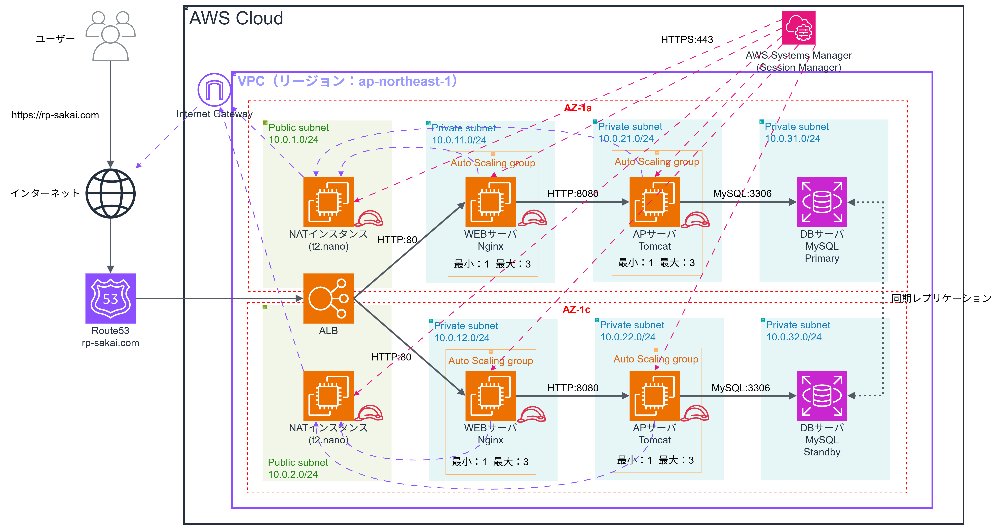

# インフラ設計書

## ドキュメント情報

| 項目 | 内容 |
|---|---|
| プロジェクト名 | 社内技術ナレッジ共有ツール インフラ基盤構築 |
| 作成日 | 2025年2月10日 |
| 最終更新日 | 2025年2月10日 |
| バージョン | 1.0 |
| 作成者 | [あなたの名前] |
| 関連ドキュメント | [要件定義書](./requirements.md) |

---

## 目次

1. [システム概要](#1-システム概要)
2. [ネットワーク設計](#2-ネットワーク設計)
3. [サーバ設計](#3-サーバ設計)
4. [データベース設計](#4-データベース設計)
5. [セキュリティ設計](#5-セキュリティ設計)
6. [可用性設計](#6-可用性設計)
7. [監視・運用設計](#7-監視運用設計)
8. [バックアップ・リカバリ設計](#8-バックアップリカバリ設計)
9. [スケーリング設計](#9-スケーリング設計)
10. [コスト試算](#10-コスト試算)
11. [設計上の考慮事項・ADR](#11-設計上の考慮事項adr)

---

## 1. システム概要

### 1.1 システム構成図



### 1.2 アーキテクチャ概要

本システムは、AWS上に構築される**3層アーキテクチャ**のWebアプリケーション基盤である。

**アーキテクチャの特徴：**
- **Multi-AZ構成**：2つのAvailability Zoneを使用し、高可用性を実現
- **完全プライベート化**：全てのアプリケーションサーバをプライベートサブネットに配置
- **IaC完全対応**：Terraformでインフラ全体をコード化
- **自動スケーリング**：負荷に応じてEC2インスタンスを自動増減

### 1.3 技術スタック

| 層 | 技術 | 用途 |
|---|---|---|
| **DNS** | Route 53 | ドメイン管理、ヘルスチェック |
| **負荷分散** | Application Load Balancer (ALB) | トラフィック分散、SSL終端 |
| **Web層** | EC2 (Amazon Linux 2023) + Nginx | Webサーバ |
| **AP層** | EC2 (Amazon Linux 2023) + Tomcat | アプリケーションサーバ |
| **DB層** | RDS for MySQL 8.0 | データベース（Multi-AZ） |
| **監視** | CloudWatch + SNS | リソース監視、アラート通知 |
| **IaC** | Terraform 1.5+ | インフラ自動化 |
| **構成管理** | Ansible 2.14+ | ミドルウェア自動設定 |

---

## 2. ネットワーク設計

### 2.1 VPC設計

| 項目 | 値 | 備考 |
|---|---|---|
| VPC CIDR | `10.0.0.0/16` | 65,536個のIPアドレス |
| リージョン | `ap-northeast-1` (東京) | 低レイテンシ、法規制対応 |
| Availability Zone | `ap-northeast-1a`, `ap-northeast-1c` | Multi-AZ構成 |

### 2.2 サブネット設計

#### パブリックサブネット

| サブネット名 | AZ | CIDR | 用途 | 配置リソース |
|---|---|---|---|---|
| public-subnet-1a | ap-northeast-1a | `10.0.1.0/24` | インターネット接続 | ALB, NAT Instance |
| public-subnet-1c | ap-northeast-1c | `10.0.2.0/24` | インターネット接続 | ALB, NAT Instance |

#### プライベートサブネット（Web層）

| サブネット名 | AZ | CIDR | 用途 | 配置リソース |
|---|---|---|---|---|
| private-web-1a | ap-northeast-1a | `10.0.10.0/24` | Web層 | EC2 (Nginx) |
| private-web-1c | ap-northeast-1c | `10.0.11.0/24` | Web層 | EC2 (Nginx) |

#### プライベートサブネット（AP層）

| サブネット名 | AZ | CIDR | 用途 | 配置リソース |
|---|---|---|---|---|
| private-ap-1a | ap-northeast-1a | `10.0.20.0/24` | AP層 | EC2 (Tomcat) |
| private-ap-1c | ap-northeast-1c | `10.0.21.0/24` | AP層 | EC2 (Tomcat) |

#### プライベートサブネット（DB層）

| サブネット名 | AZ | CIDR | 用途 | 配置リソース |
|---|---|---|---|---|
| private-db-1a | ap-northeast-1a | `10.0.30.0/24` | DB層 | RDS (Primary) |
| private-db-1c | ap-northeast-1c | `10.0.31.0/24` | DB層 | RDS (Standby) |

### 2.3 ルートテーブル設計

#### パブリックサブネット用ルートテーブル

| 送信先 | ターゲット | 用途 |
|---|---|---|
| `10.0.0.0/16` | local | VPC内通信 |
| `0.0.0.0/0` | Internet Gateway | インターネット向け通信 |

#### プライベートサブネット用ルートテーブル（Web/AP層）

| 送信先 | ターゲット | 用途 |
|---|---|---|
| `10.0.0.0/16` | local | VPC内通信 |
| `0.0.0.0/0` | NAT Instance | インターネット向け通信（パッケージ更新等） |

#### プライベートサブネット用ルートテーブル（DB層）

| 送信先 | ターゲット | 用途 |
|---|---|---|
| `10.0.0.0/16` | local | VPC内通信のみ |

### 2.4 通信フロー

```
【ユーザーアクセス時】
Internet
  ↓ HTTPS (443)
Route 53 (DNS解決)
  ↓
ALB (Public Subnet)
  ↓ HTTP (80)
EC2 - Web層 (Private Subnet)
  ↓ HTTP (8080)
EC2 - AP層 (Private Subnet)
  ↓ MySQL (3306)
RDS (Private Subnet)

【EC2からインターネットアクセス】
EC2 (Private Subnet)
  ↓
NAT Instance (Public Subnet)
  ↓
Internet Gateway
  ↓
Internet
```

---

## 3. サーバ設計

### 3.1 Web層サーバ（Nginx）

| 項目 | 値 | 備考 |
|---|---|---|
| **インスタンスタイプ** | t3.micro | vCPU: 2, メモリ: 1GB |
| **OS** | Amazon Linux 2023 | 最新のAWSサポートOS |
| **台数** | 2台（通常時）、1〜4台（Auto Scaling） | 負荷に応じて自動増減 |
| **配置** | プライベートサブネット（Web層） | Multi-AZ |
| **ミドルウェア** | Nginx 1.24+ | リバースプロキシ、静的コンテンツ配信 |
| **ストレージ** | gp3 20GB | 汎用SSD |
| **IAMロール** | EC2-SSM-Role | Session Manager接続用 |

#### ソフトウェア構成

```
Amazon Linux 2023
├── Nginx 1.24+
├── CloudWatch Agent（ログ収集）
└── SSM Agent（リモートアクセス用）
```

### 3.2 AP層サーバ（Tomcat）

| 項目 | 値 | 備考 |
|---|---|---|
| **インスタンスタイプ** | t3.micro | vCPU: 2, メモリ: 1GB |
| **OS** | Amazon Linux 2023 | 最新のAWSサポートOS |
| **台数** | 2台（通常時）、1〜4台（Auto Scaling） | 負荷に応じて自動増減 |
| **配置** | プライベートサブネット（AP層） | Multi-AZ |
| **ミドルウェア** | Tomcat 10.x / PHP-FPM | アプリケーション実行環境 |
| **ストレージ** | gp3 20GB | 汎用SSD |
| **IAMロール** | EC2-SSM-Role | Session Manager接続用 |

#### ソフトウェア構成

```
Amazon Linux 2023
├── Java 17
├── Tomcat 10.1.x
├── CloudWatch Agent（ログ収集）
└── SSM Agent（リモートアクセス用）
```

### 3.3 NAT Instance

| 項目 | 値 | 備考 |
|---|---|---|
| **インスタンスタイプ** | t3.nano | vCPU: 2, メモリ: 0.5GB |
| **OS** | Amazon Linux 2023 | |
| **台数** | 2台（Multi-AZ） | 各AZに1台ずつ配置 |
| **配置** | パブリックサブネット | |
| **用途** | プライベートサブネットからのインターネットアクセス | パッケージ更新、外部API通信 |

**NAT Gateway vs NAT Instance の選定理由：**
- コスト削減：NAT Gatewayは$32/月/台、NAT Instanceは$3/月/台
- 検証環境では十分なスループット
- Terraformで簡単に構築可能

---

## 4. データベース設計

### 4.1 RDS設計

| 項目 | 値 | 備考 |
|---|---|---|
| **エンジン** | MySQL 8.0.35 | 最新の安定版 |
| **インスタンスタイプ** | db.t3.micro | vCPU: 2, メモリ: 1GB |
| **Multi-AZ** | 有効 | Primary/Standby構成 |
| **ストレージ** | gp3 20GB | 汎用SSD |
| **ストレージ自動拡張** | 有効（最大100GB） | 容量不足時に自動拡張 |
| **暗号化** | 有効（KMS） | データ暗号化 |
| **自動バックアップ** | 有効（保持期間7日） | 毎日深夜に自動実行 |
| **メンテナンスウィンドウ** | 日曜 03:00-04:00 JST | 影響の少ない時間帯 |
| **パラメータグループ** | カスタム | 文字コード: utf8mb4 |

### 4.2 パラメータ設定

```sql
-- 文字コード設定
character_set_server = utf8mb4
collation_server = utf8mb4_unicode_ci

-- 接続設定
max_connections = 100

-- ログ設定
slow_query_log = 1
long_query_time = 2
log_queries_not_using_indexes = 1
```

### 4.3 接続情報

| 項目 | 値 |
|---|---|
| **エンドポイント** | `knowledge-db.xxxxx.ap-northeast-1.rds.amazonaws.com` |
| **ポート** | 3306 |
| **データベース名** | `knowledge_db` |
| **ユーザー名** | `admin` |
| **パスワード** | Secrets Manager で管理 |

---

## 5. セキュリティ設計

### 5.1 セキュリティグループ設計

#### ALB用セキュリティグループ（alb-sg）

| 方向 | プロトコル | ポート | 送信元/送信先 | 用途 |
|---|---|---|---|---|
| Inbound | TCP | 80 | 0.0.0.0/0 | HTTP（HTTPSへリダイレクト） |
| Inbound | TCP | 443 | 0.0.0.0/0 | HTTPS |
| Outbound | TCP | 80 | web-sg | Web層への転送 |

#### Web層用セキュリティグループ（web-sg）

| 方向 | プロトコル | ポート | 送信元/送信先 | 用途 |
|---|---|---|---|---|
| Inbound | TCP | 80 | alb-sg | ALBからのHTTP通信 |
| Outbound | TCP | 8080 | ap-sg | AP層への転送 |
| Outbound | TCP | 80, 443 | 0.0.0.0/0 | パッケージ更新（NAT経由） |

#### AP層用セキュリティグループ（ap-sg）

| 方向 | プロトコル | ポート | 送信元/送信先 | 用途 |
|---|---|---|---|---|
| Inbound | TCP | 8080 | web-sg | Web層からの通信 |
| Outbound | TCP | 3306 | db-sg | データベースアクセス |
| Outbound | TCP | 80, 443 | 0.0.0.0/0 | パッケージ更新（NAT経由） |

#### DB用セキュリティグループ（db-sg）

| 方向 | プロトコル | ポート | 送信元/送信先 | 用途 |
|---|---|---|---|---|
| Inbound | TCP | 3306 | ap-sg | AP層からのMySQL接続 |
| Outbound | - | - | - | Outbound不要 |

#### NAT Instance用セキュリティグループ（nat-sg）

| 方向 | プロトコル | ポート | 送信元/送信先 | 用途 |
|---|---|---|---|---|
| Inbound | TCP | 80, 443 | 10.0.0.0/16 | VPC内からのHTTP/HTTPS |
| Outbound | TCP | 80, 443 | 0.0.0.0/0 | インターネットへ |

### 5.2 IAMロール設計

#### EC2用IAMロール（EC2-SSM-Role）

**目的：** Session Manager経由でのアクセス、CloudWatchへのログ送信

**付与するポリシー：**
- `AmazonSSMManagedInstanceCore` （Session Manager用）
- `CloudWatchAgentServerPolicy` （CloudWatch Logs送信用）

```json
{
  "Version": "2012-10-17",
  "Statement": [
    {
      "Effect": "Allow",
      "Principal": {
        "Service": "ec2.amazonaws.com"
      },
      "Action": "sts:AssumeRole"
    }
  ]
}
```

### 5.3 暗号化設計

| 対象 | 暗号化方式 | 暗号化範囲 |
|---|---|---|
| **通信（インターネット〜ALB）** | TLS 1.2以上 | HTTPS通信 |
| **通信（ALB〜EC2）** | HTTP（内部通信） | VPC内のため平文 |
| **RDS（保存データ）** | AES-256（KMS） | DB内の全データ |
| **RDS（バックアップ）** | AES-256（KMS） | 自動バックアップ |
| **EBS（EC2ストレージ）** | AES-256（KMS） | オプション（必要に応じて有効化） |

### 5.4 アクセス制御

#### SSH接続の完全禁止

- **SSHポート（22番）を一切開放しない**
- AWS Systems Manager Session Managerを使用
- ブラウザ経由で安全にアクセス

#### データベースアクセス制限

- AP層のセキュリティグループからのみ接続許可
- パブリックアクセス無効
- 認証情報はSecrets Managerで管理

---

## 6. 可用性設計

### 6.1 Multi-AZ構成

| コンポーネント | 冗長化方式 | 目的 |
|---|---|---|
| **ALB** | 自動Multi-AZ配置 | 負荷分散装置の冗長化 |
| **EC2（Web層）** | 2つのAZに各1台以上配置 | Webサーバの冗長化 |
| **EC2（AP層）** | 2つのAZに各1台以上配置 | APサーバの冗長化 |
| **RDS** | Multi-AZ（自動フェイルオーバー） | データベースの冗長化 |
| **NAT Instance** | 各AZに1台ずつ配置 | インターネット接続の冗長化 |

### 6.2 可用性目標

| 項目 | 目標値 | 実現方法 |
|---|---|---|
| **稼働率** | 99.5%以上 | Multi-AZ構成、Auto Scaling |
| **RTO（目標復旧時間）** | 1時間以内 | RDS自動フェイルオーバー（1〜2分） |
| **RPO（目標復旧時点）** | 1時間以内 | RDS自動バックアップ |
| **ダウンタイム** | 月間3.6時間以内 | 計画メンテナンスを含む |

### 6.3 障害時の動作

#### パターン1：Web層EC2障害

```
1. ALBヘルスチェックが失敗を検知
2. 該当インスタンスへのトラフィック停止
3. 正常なインスタンスにトラフィック転送
4. Auto Scalingにより新しいインスタンスを起動
```

#### パターン2：AP層EC2障害

```
1. Web層からの接続エラーを検知
2. リトライ処理により別のAPサーバに接続
3. Auto Scalingにより新しいインスタンスを起動
```

#### パターン3：RDS障害（Multi-AZ）

```
1. Primaryインスタンス障害検知
2. 自動的にStandbyへフェイルオーバー（1〜2分）
3. エンドポイントは変更なし
4. アプリケーションは自動再接続
```

#### パターン4：AZ全体障害

```
1. 片方のAZが完全停止
2. もう一方のAZで全サービス継続
3. パフォーマンス低下の可能性あり
4. Auto Scalingにより正常AZでインスタンス追加
```

---

## 7. 監視・運用設計

### 7.1 CloudWatch監視項目

#### ALB

| メトリクス | 閾値 | アクション |
|---|---|---|
| UnHealthyHostCount | > 0（5分間） | SNS通知 |
| TargetResponseTime | > 3秒（3回連続） | SNS通知 |
| HTTPCode_Target_5XX_Count | > 10（5分間） | SNS通知 |

#### EC2（Web層・AP層）

| メトリクス | 閾値 | アクション |
|---|---|---|
| CPUUtilization | > 70%（2分間） | Auto Scaling + SNS通知 |
| CPUUtilization | < 30%（5分間） | Auto Scaling（スケールイン） |
| StatusCheckFailed | > 0 | SNS通知、自動復旧 |
| MemoryUtilization | > 80%（5分間） | SNS通知 |

#### RDS

| メトリクス | 閾値 | アクション |
|---|---|---|
| CPUUtilization | > 80%（5分間） | SNS通知 |
| FreeStorageSpace | < 2GB | SNS通知 |
| DatabaseConnections | > 80 | SNS通知 |
| ReadLatency / WriteLatency | > 100ms | SNS通知 |

### 7.2 ログ管理

#### アプリケーションログ

| ログ種別 | 送信先 | 保持期間 |
|---|---|---|
| Nginxアクセスログ | CloudWatch Logs | 30日 |
| Nginxエラーログ | CloudWatch Logs | 30日 |
| Tomcatアプリケーションログ | CloudWatch Logs | 30日 |
| Tomcatエラーログ | CloudWatch Logs | 30日 |

#### インフラログ

| ログ種別 | 送信先 | 保持期間 |
|---|---|---|
| ALBアクセスログ | S3バケット | 90日 |
| VPCフローログ | CloudWatch Logs | 14日 |
| RDSスロークエリログ | CloudWatch Logs | 7日 |

### 7.3 アラート通知

#### SNSトピック設計

```
SNSトピック: infrastructure-alerts
購読者:
  - Email: ops-team@example.com
  - Slack: #infrastructure-alerts（Webhook経由）
```

#### アラートレベル

| レベル | 条件 | 通知先 |
|---|---|---|
| **Critical** | サービス停止に直結 | Email + Slack + 電話 |
| **Warning** | 性能劣化、リソース逼迫 | Email + Slack |
| **Info** | Auto Scaling発動等 | Slackのみ |

---

## 8. バックアップ・リカバリ設計

### 8.1 RDSバックアップ

| 項目 | 設定値 |
|---|---|
| **自動バックアップ** | 有効 |
| **バックアップウィンドウ** | 02:00-03:00 JST |
| **保持期間** | 7日間 |
| **スナップショット** | 手動取得（重要な変更前） |
| **暗号化** | 有効（KMS） |

### 8.2 リカバリ手順

#### データベース復旧（ポイントインタイムリカバリ）

```bash
# 特定時点へのリストア
aws rds restore-db-instance-to-point-in-time \
  --source-db-instance-identifier knowledge-db \
  --target-db-instance-identifier knowledge-db-restored \
  --restore-time 2025-02-10T15:00:00Z
```

#### スナップショットからの復旧

```bash
# 手動スナップショットからリストア
aws rds restore-db-instance-from-db-snapshot \
  --db-instance-identifier knowledge-db-restored \
  --db-snapshot-identifier knowledge-db-snapshot-20250210
```

### 8.3 DR（災害復旧）計画

| シナリオ | RTO | RPO | 復旧手順 |
|---|---|---|---|
| **EC2障害** | 5分 | 0分 | Auto Scalingで自動復旧 |
| **RDS障害** | 2分 | 0分 | Multi-AZ自動フェイルオーバー |
| **AZ障害** | 10分 | 0分 | もう一方のAZで継続稼働 |
| **リージョン障害** | - | - | 未対応（将来的にマルチリージョン検討） |
| **データ誤削除** | 1時間 | 1時間 | バックアップからリストア |

---

## 9. スケーリング設計

### 9.1 Auto Scaling設定

#### Web層

```hcl
# Auto Scaling Group設定
resource "aws_autoscaling_group" "web" {
  min_size             = 1
  max_size             = 4
  desired_capacity     = 2
  health_check_type    = "ELB"
  health_check_grace_period = 300
}

# スケールアウトポリシー
resource "aws_autoscaling_policy" "web_scale_out" {
  scaling_adjustment = 1
  adjustment_type    = "ChangeInCapacity"
  cooldown           = 300
}

# スケールインポリシー
resource "aws_autoscaling_policy" "web_scale_in" {
  scaling_adjustment = -1
  adjustment_type    = "ChangeInCapacity"
  cooldown           = 600
}
```

#### スケーリング条件

| 条件 | 閾値 | アクション | クールダウン |
|---|---|---|---|
| CPU使用率 > 70% | 2分間継続 | スケールアウト（+1台） | 5分 |
| CPU使用率 < 30% | 5分間継続 | スケールイン（-1台） | 10分 |

### 9.2 RDSスケーリング

| 項目 | 設定 |
|---|---|
| **ストレージ自動拡張** | 有効 |
| **拡張閾値** | 空き容量 < 10% |
| **最大容量** | 100GB |
| **垂直スケーリング** | 手動（インスタンスタイプ変更） |

---

## 10. コスト試算

### 10.1 月額コスト（東京リージョン）

#### 検証環境

| サービス | 構成 | 単価 | 台数 | 月額 |
|---|---|---|---|---|
| EC2（Web） | t3.micro | $7.5/月 | 2台 | $15 |
| EC2（AP） | t3.micro | $7.5/月 | 2台 | $15 |
| NAT Instance | t3.nano | $3/月 | 2台 | $6 |
| RDS | db.t3.micro（Multi-AZ） | $30/月 | 1台 | $30 |
| ALB | - | $20/月 | 1台 | $20 |
| Route 53 | ホストゾーン | $0.5/月 | 1個 | $0.5 |
| データ転送 | 小規模想定 | - | - | $5 |
| **合計** | | | | **$91.5/月** |

#### 本番環境（想定）

| サービス | 構成 | 単価 | 台数 | 月額 |
|---|---|---|---|---|
| EC2（Web） | t3.small | $15/月 | 2台 | $30 |
| EC2（AP） | t3.small | $15/月 | 2台 | $30 |
| NAT Gateway | - | $32/月 | 2台 | $64 |
| RDS | db.t3.small（Multi-AZ） | $60/月 | 1台 | $60 |
| ALB | - | $20/月 | 1台 | $20 |
| Route 53 | ホストゾーン | $0.5/月 | 1個 | $0.5 |
| CloudWatch | ログ保存 | - | - | $10 |
| データ転送 | 中規模想定 | - | - | $20 |
| **合計** | | | | **$234.5/月** |

### 10.2 コスト最適化施策

| 施策 | 効果 | 備考 |
|---|---|---|
| NAT InstanceをNAT Gatewayに変更 | -$58/月 | 検証環境での施策 |
| Reserved Instance適用 | -30%（EC2） | 1年契約 |
| Savings Plans適用 | -20%（全体） | 1年契約 |
| 不要リソースの削除 | 変動 | 定期的な棚卸し |

---

## 11. 設計上の考慮事項・ADR

### 11.1 主要な設計判断

#### ADR-001: Multi-AZ構成の採用

**決定：** 全てのコンポーネントをMulti-AZ構成とする

**理由：**
- 可用性要件（99.5%）を満たすため
- AZ障害時もサービス継続が必要
- ビジネスクリティカルな社内システムのため

**代替案：**
- Single-AZ構成：コスト削減できるが、可用性要件を満たせない

---

#### ADR-002: NAT InstanceをNAT Gatewayの代わりに使用

**決定：** 検証環境ではNAT Instanceを使用

**理由：**
- コスト削減（$64/月 → $6/月、約90%削減）
- 検証環境では高スループット不要
- Terraformで簡単に構築可能

**代替案：**
- NAT Gateway：マネージドで運用不要だが、コストが高い
- 本番環境ではNAT Gatewayへの変更を検討

---

#### ADR-003: Session ManagerによるSSH不要化

**決定：** SSHポートを一切開放せず、Session Managerを使用

**理由：**
- セキュリティ強化（SSH鍵管理不要、ポート開放不要）
- 監査ログが自動記録される
- ブラウザから直接アクセス可能

**代替案：**
- 踏み台サーバ経由のSSH：管理コストが高い、セキュリティリスクあり

---

#### ADR-004: 3層アーキテクチャの採用

**決定：** Web層、AP層、DB層を完全分離

**理由：**
- セキュリティ：各層をセキュリティグループで厳密に制御
- スケーラビリティ：各層を独立してスケール可能
- 保守性：ミドルウェアのアップデートが容易

**代替案：**
- 2層構成（Web+AP統合）：シンプルだが、柔軟性に欠ける

---

#### ADR-005: TerraformによるIaC化

**決定：** インフラ全体をTerraformでコード化

**理由：**
- 再現性：環境の複製が容易
- バージョン管理：Gitで変更履歴を管理
- レビュー：Pull Requestでインフラ変更をレビュー可能

**代替案：**
- CloudFormation：AWSネイティブだが、記述が冗長
- 手動構築：再現性がなく、ヒューマンエラーのリスク

---

### 11.2 今後の検討課題

| 課題 | 優先度 | 検討時期 |
|---|---|---|
| CI/CDパイプライン構築 | 高 | フェーズ2 |
| WAF導入（セキュリティ強化） | 中 | フェーズ2 |
| CloudFront導入（パフォーマンス改善） | 中 | フェーズ3 |
| マルチリージョン対応（DR強化） | 低 | フェーズ4 |
| Kubernetes移行（コンテナ化） | 低 | フェーズ5 |

---

## 変更履歴

| バージョン | 日付 | 変更者 | 変更内容 |
|---|---|---|---|
| 1.0 | 2025/02/10 | [あなたの名前] | 初版作成 |

---

## 承認

| 役割 | 氏名 | 承認日 | 署名 |
|---|---|---|---|
| インフラ責任者 | - | - | - |
| セキュリティ責任者 | - | - | - |
| プロジェクトマネージャー | - | - | - |